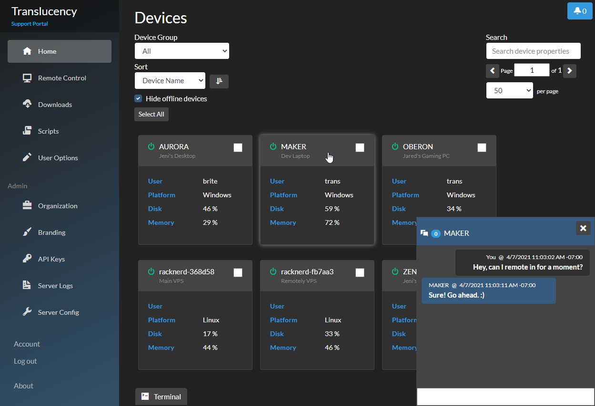

# Remotely
A remote control and remote scripting solution, built with .NET 6, Blazor, and SignalR Core.

[](https://dev.azure.com/translucency/Remotely/_build/latest?definitionId=32&branchName=master)
[](https://github.com/immense/Remotely/actions/workflows/run_tests.yml)

# Status 
## 2022-05-19
Immense Networks is the proud new owner of Remotely. We intend to keep Remotely fully open-source.

I (Darren Kattan) had followed this project since the moment Jared shared it on r/msp years ago. While Jared was writing Remotely, we were writing our own tool for MSPs called ImmyBot, primarily focused on automation and software deployment. Jared and I had similar goals and he felt that we would be good custodians of the project. 

ImmyBot experienced explosive growth this year and we only have 4 developers which is why there hasn't been much activity here. We did a big push earlier this year to build an integration between Remotely and ImmyBot but ran into some technical challenges trying to keep only one agent on machines, but we don't want to cannibalize Remotely for the gain of ImmyBot. We want to keep Remotely fully operable as a standalone project. When we resume this initiate later this year, you will likely abstraction of the Remotely.Desktop code into a shared library that can be consumed by Remotely as well as other agents like ImmyBot.


## Project Links
Subreddit: https://www.reddit.com/r/remotely_app/  
Docker: https://hub.docker.com/r/immybot/remotely  
Video Tutorials: https://remotely.one/Tutorials  



## Quickstart
```
mkdir -p /var/www/remotely
docker run -d --name remotely --restart unless-stopped -p 5000:5000 -v /var/www/remotely:/remotely-data immybot/remotely:latest
```


## After Installation
- Data for Remotely will be saved in `/var/www/remotely/` within two files: appsettings.json and Remotely.db.
  - These files will persist through teardown and setup of new Remotely containers.
  - If upgrading from a non-Docker version of Remotely, overwrite these files with the ones from your previous installation.
- Use a reverse proxy like Nginx or Caddy if you want to expose the site to the internet.
- If this is the first run, create your account by clicking the `Register` button on the main page.
  - This account will be both the server admin and organization admin.
  - An organization is automatically created for the account.
    - Organizations are used to group together users, devices, and other data items into a single pool.
    - By default, only one organization can exist on a server.
    - The `Register` button will disappear.
    - People will no longer be able to create accounts on their own.
    - To allow self-registration, increase the `MaxOrganizationCount` or set it to -1 (see Configuration section).


## Update the Docker Container
```
docker stop remotely
docker rm remotely
docker pull immybot/remotely:latest
docker run -d --name remotely --restart unless-stopped -p 5000:5000 -v /var/www/remotely:/remotely-data immybot/remotely:latest
```

## Alternative Hosting Methods
Starting in 2023, Docker will be the only supported way of hosting Remotely.  Given the number of Linux distributions and other enviromental unknowns, it will be easier to create a consistently reliable deployment process if we focus on Docker.  Also, the server is now able to dynamically embed the server/organization data into the EXE while it's downloading, so hard-coding the information in a custom build is no longer necessary.

Nevertheless, Remotely can still be hosted using a service manager (e.g. `systemd`) and `dotnet`.  We still provide the Linux x64 binaries in each GitHub release that will work on most major distros.  Please refer to the [official documentation](https://learn.microsoft.com/en-us/aspnet/core/host-and-deploy/) that addresses most hosting scenarios.

If you still need to build from source, the `Publish.ps1` script will continue to work, as it's used when building the Docker image.  Below is an example of what I was using to build and publish to my local test server before moving to Docker.

Please note, no further support will be provided for these alternative hosting methods.  If you're unfamiliar with running your own ASP.NET Core app, it's recommended that you use Docker.

```
$Root = "C:\repos\Remotely"
Set-Location -Path $Root
$VersionString = git show -s --format=%ci
$VersionDate = [DateTimeOffset]::Parse($VersionString)
$CurrentVersion = $VersionDate.ToString("yyyy.MM.dd.HHmm")

&"$Root\Utilities\Publish.ps1" -rid ubuntu-x64 -outdir "C:\publish"
scp -r "$Drive\publish\*" "jared@cubey:/var/www/remotely-test/"
ssh jared@cubey sudo systemctl restart remotely-test
```

## Build and Debug Instructions (Windows 11)  
The following steps will configure your Windows 11 machine for building the Remotely server and clients.
* Install Visual Studio 2022.
    * Link: https://visualstudio.microsoft.com/downloads/
	* You should have the following Workloads selected:
	    * ASP.NET and web development
		* .NET desktop development
		* .NET Core cross-platform development
	* You should have the following Individual Components selected:
	    * .NET SDK (latest version).
		* MSBuild (which auto-selects Roslyn compilers).
		* NuGet targets and build tasks.
		* .NET Framework 4.8 SDK.
	    * For debugging and development, you'll need all relevant workloads.
* Install Git for Windows.
    * Link: https://git-scm.com/downloads
* Install the latest LTS Node:
	* Link: https://nodejs.org/
* Clone the git repository: `git clone https://github.com/immense/Remotely --recurse`
* When debugging, the agent will use a pre-defined device ID and connect to https://localhost:5001.
* In development environment, the server will assign all connecting agents to the first organization.
* The above two allow you to debug the agent and server together, and see your device in the list.

## Admin Accounts
The first account created will be an admin for both the server and the organization that's created for the account.

An organization admin has access to the Organization page and server log entries specific to his/her organization.  A server admin has access to the Server Config page and can see server log entries that don't belong to an organization. 


## Branding
Within the Account section, there is a tab for branding, which will apply to the quick support clients and Windows installer.

However, the clients will need to have been built from source with the server URL hard-coded in the apps for them to be able to retrieve the branding info.

## Configuration
The following settings are available in appsettings.json, under the ApplicationOptions section.

When deployed to production, the application will use the `appsettings.Production.json` file, if it's present. To retain your settings between upgrades, copy your `appsettings.json` file to `appsettings.Production.json` on your production server, then make your configuration changes.

Likewise, `appsettings.Development.json` can be used while developing in Visual Studio to override the other.

Whenever there's a reference to `appsettings.json` in this document, it refers to whichever file is currently being used.

For more information on configuring ASP.NET Core, see https://docs.microsoft.com/en-us/aspnet/core/fundamentals/configuration/.

* AllowApiLogin: Whether to allow logging in via the API controller.  API access tokens are recommended over this approach.
* BannedDevices: An array of device IDs, names, or IP addresses to ban.  When they try to connect, an uninstall command will immediately be sent back.
* DataRetentionInDays: How long logs and other data will be kept on the server.  Set to -1 to retain indefinitely (not recommended).
* DBProvider: Determines which of the three connection strings (at the top) will be used.  The appropriate DB provider for the database type is automatically loaded in code.
* EnableWindowsEventLog: Whether to also add server log entries to the Windows Event Log.
* EnforceAttendedAccess: Clients will be prompted to allow unattended remote control attempts.
* KnownProxies: If your reverse proxy is on a different machine and is forwarding requests to the Remotely server, you will need to add the IP of the reverse proxy server to this array.
* MaxOrganizationCount: By default, one organization can exist on the server, which is created automatically when the first account is registered.  Afterward, self-registration will be disabled.
    * Set this to -1 or increase it to a specific number to allow multi-tenancy.
* RedirectToHttps: Whether ASP.NET Core will redirect all traffic from HTTP to HTTPS.  This is independent of Caddy, Nginx, and IIS configurations that do the same.
* RemoteControlNotifyUsers: Whether to show a notification to the end user when an unattended remote control session starts.
* RemoteControlSessionLimit: How many concurrent remote control sessions are allowed per organization.
* RemoteControlRequiresAuthentication: Whether the remote control page requires authentication to establish a connection.
* Require2FA: Require users to set up 2FA before they can use the main app.
* Smpt*: SMTP settings for auto-generated system emails (such as registration and password reset).
* Theme: The color theme to use for the site.  Values are "Light" or "Dark".  This can also be configured per-user in Account - Options.
* TrustedCorsOrigins: For cross-origin API requests via JavaScript.  The websites listed in this array with be allowed to make requests to the API.  This does not grant authentication, which is still required on most endpoints.
* UseHsts: Whether ASP.NET Core will use HTTP Strict Transport Security.


## Changing the Database
By default, Remotely uses a SQLite database.  When first run, it creates a file as specified for the SQLite connection string in appsettings.json.

You can change database by changing `DBProvider` in `ApplicationOptions` to `SQLServer` or `PostgreSQL`.  Be sure to set the connection string for the new database provider in the server's `appsettings.Production.json`.

## Logging
* On clients, logs are kept in %temp%\Remotely_Logs.log.
	* For the Agent running as a Windows service, this maps to C:\Windows\Temp\Remotely_Logs.log.
* On the server, some event information is explicitly written to the EventLogs table in the database.
* Built-in ASP.NET Core logs are written to the console (stdout).  You can redirect this to a file if desired.
	* In IIS, this can be done in the web.config file by setting stdoutLogEnabled to true.
* On Windows Servers, the above logs can also be written to the Windows Event Log.
	* This is enabled in appsettings.json by setting EnableWindowsEventLog to true.
* You can configure logging levels and other settings in appsetttings.json.
	* More information: https://docs.microsoft.com/en-us/aspnet/core/fundamentals/logging/

## Remote Control Client Requirements
* Windows: Only the latest version of Windows 11 is tested.  Windows 7 and 8.1 should work, though performance will be reduced on Windows 7.
	* Windows 2019/2022 should work as well, but isn't tested regularly.
* Linux: Only the latest LTS version of Ubuntu is tested.
* For the Ubuntu's "quick support" client, you must first install the following dependencies:
    * libx11-dev
	* libxrandr-dev
    * libc6-dev
    * libgdiplus
    * libxtst-dev
    * xclip

## Remote Control on Mobile
Ideally, you'd be doing remote control from an actual computer or laptop.  However, I've tried to make the remote control at least somewhat usable from a mobile device.  Here are the controls:
* Left-click: Single tap
* Right-click: Tap and hold
* Click-and-drag: Tap and hold with one finger, tap and release a second finger (without pinch-zooming)
	* The click-and-drag operation will begin where finger one is held.

## End User Support Page
There's a page at `/GetSupport` where end users can request support.  When the form is submitted, an alert appears on the main page, above the grid.

A shortcut to this page is placed in the `\Program Files\Remotely\` folder.  You can copy it anywhere you like.  You can also have it copied to the desktop automatically by using the `-supportshortcut` switch on the installer.
	
## .NET Deployments
* .NET has two methods of deployment: framework-dependent and self-contained.
	* Framework-dependent deployments require the .NET runtime to be installed on the target computers.  It must be the same version that was used to build the app.
	* Self-contained deployments include a copy of the runtime, so you don't need to install it on the target computers.  As a result, the total file size is much larger.
* .NET uses runtime identifiers that are targeted when building.
	* Link: https://docs.microsoft.com/en-us/dotnet/core/rid-catalog


## Shortcut Keys
There are a few shortcut keys available when using the console.
* / : Slash will allow you to switch between shells.  The names are configurable in the Options page.
* Up/Down: Use arrow up/down to cycle through input history.
* Ctrl + Q: Clear the output window.

## Port Configuration
You can change the local port that the Remotely .NET server listens on by adding the below to `appsettings.Production.json`:

```
"Kestrel": {
    "Endpoints": {
      "Http": {
        "Url": "http://localhost:{port-number}"
      }
    }
  }
```

Alternatively, you can use a command-line argument for the `Remotely_Server` process or set an environment variable.
  - `--urls http://localhost:{port-number}`
  - `ASPNETCORE_URLS=http://localhost:{port-number}`

## API and Integrations
Remotely has a basic API, which can be browsed at https://remotely.lucency.co/swagger (or your own server instance).  Most endpoints require authentication via an API access token, which can be created by going to Account - API Access.

When accessing the API from the browser on another website, you'll need to set up CORS in appsettings by adding the website origin URL to the TrustedCorsOrigins array.  If you're not familiar with how CORS works, I recommend reading up on it before proceeding.  For example, if I wanted to create a login form on https://lucency.co that logged into the Remotely API, I'd need to add "https://lucency.co" to the TrustedCorsOrigins.

The API key and secret must first be combined [ApiKey]:[ApiSecret] and then encoded with Base64 as [EncodedAuhorization]. After that you can add the encoded string to the request's Authorization header in the form "Basic [EncodedAuhorization]"

Below is an example API request:

	POST https://localhost:5001/API/Scripting/ExecuteCommand/PSCore/f2b0a595-5ea8-471b-975f-12e70e0f3497 HTTP/1.1
	Content-Type: application/json
	Authorization: 31fb288d-af97-4ce1-ae7b-ceebb98281ac:HLkrKaZGExYvozSPvcACZw9awKkhHnNK
	User-Agent: PostmanRuntime/7.22.0
	Accept: */*
	Cache-Control: no-cache
	Host: localhost:5001
	Accept-Encoding: gzip, deflate, br
	Content-Length: 12
	Connection: close

	Get-Location

Below are examples of using the cookie-based login API (JavaScript):

	// Log in with one request, then launch remote control with another.
	fetch("https://localhost:5001/api/Login/", {
		method: "post",
		credentials: "include",
		mode: "cors",
		body: '{"email":"email@example.com", "password":"P@ssword1"}',
		headers: {
			"Content-Type": "application/json",
		}
	}).then(response=>{
		if (response.ok) {
			fetch("https://localhost:44351/api/RemoteControl/Viewer/b68c24b0-2c67-4524-ad28-dadea7a576a4", {
				method: "get",
				credentials: "include",
				mode: "cors"
			}).then(response=>{
				if (response.ok) {
					response.text().then(url=>{
						window.open(url);
					})
				}
			})
		}
	})

	// Log in and launch remote control in the same request.
	fetch("https://localhost:5001/api/RemoteControl/Viewer/", {
		method: "post",
		credentials: "include",
		mode: "cors",
		body: '{"email":"email@example.com", "password":"P@ssword1", "deviceID":"b68c24b0-2c67-4524-ad28-dadea7a576a4"}',
		headers: {
			"Content-Type": "application/json",
		}
	}).then(response=>{
		if (response.ok) {
			response.text().then(url=>{
				window.open(url);
			})
		}
	})

## Alerts
The Alerts API gives you the ability to add monitoring and alerting functionality to your device endpoints.  This feature is intended to add basic RMM-type functionality without diverging too far from Remotely's primary purpose.

Alerts can be set up to show a notification on the Remotely website, send an email, and/or perform a separate API request.

To use Alerts, you'd first need to make an API token (or multiple tokens) for your devices to use.  Then create a scheduled task or some other recurring script to do the work.  Below is an example of how to use PowerShell to create a Scheduled Job that checks the disk space on a daily schedule.

```
$Trigger = New-JobTrigger -Daily -At "5 AM"
$Option = New-ScheduledJobOption -RequireNetwork

Register-ScheduledJob -ScriptBlock {
    $OsDrive = Get-PSDrive -Name C
    $FreeSpace = $OsDrive.Free / ($OsDrive.Used + $OsDrive.Free)
    if ($FreeSpace -lt .1) {
        Invoke-WebRequest -Uri "https://localhost:5001/api/Alerts/Create/" -Method Post -Headers @{ 
            Authorization="3e9d8273-1dc1-4303-bd50-7a133e36b9b7:S+82XKZdvg278pSFHWtUklqHENuO5IhH"
        } -Body @"
            {
                "AlertDeviceID": "f2b0a595-5ea8-471b-975f-12e70e0f3497",
                "AlertMessage": "Low hard drive space. Free Space: $([Math]::Round($FreeSpace * 100))%",
                "ApiRequestBody": null,
                "ApiRequestHeaders": null,
                "ApiRequestMethod": null,
                "ApiRequestUrl": null,
                "EmailBody": "Low hard drive space for device Maker.",
                "EmailSubject": "Hard Drive Space Alert",
                "EmailTo": "translucency_software@outlook.com",
                "ShouldAlert": true,
                "ShouldEmail": true,
                "ShouldSendApiRequest": false
            }
"@ -ContentType "application/json"
    }
} -Name "Check OS Drive Space" -Trigger $Trigger -ScheduledJobOption $Option
```
